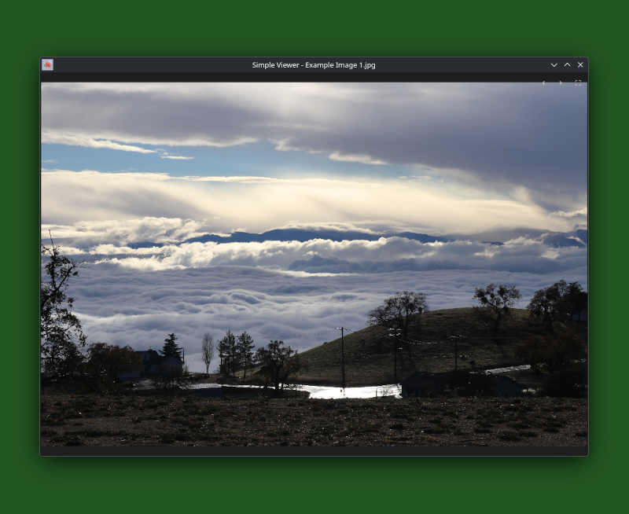
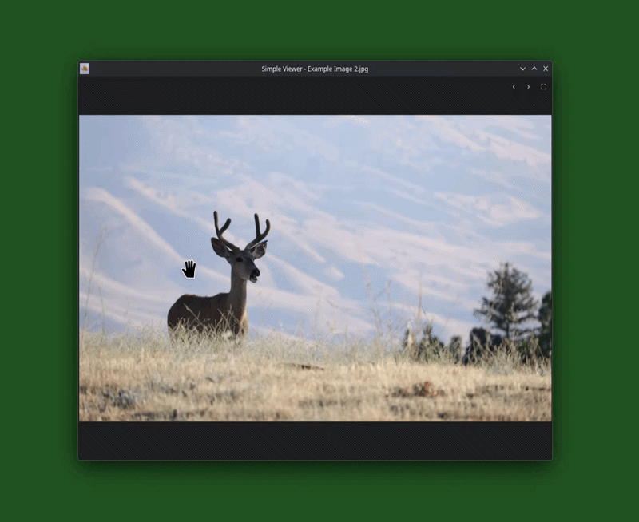

# Simple Viewer (v1.0)

**A lightweight, modern, and distraction-free image viewer with super easy crop, and other edit features.**


---

## ✨ Features

- **Distraction-Free UI** - No menu bar; everything via right-click context menu, floating nav buttons, keyboard shortcuts, and mouse gestures
- **Powerful Crop Tool** - Right-click + drag with live rubber band; 8 aspect ratio presets (Free, 1:1, 3:2, 4:3, 16:9, etc.); draggable handles and floating apply/cancel panel
- **Transforms** - Rotate left/right, horizontal mirror, vertical flip, and resize - all non-destructive until you save
- **Zoom, Pan & Fit** - Wheel or Ctrl++ / Ctrl+- zoom (cursor-centered), click+drag pan, F to fit, toggleable auto-resize
- **Animation Support** - Play/pause animated GIFs and other formats with Space or P key
- **Built-in File Tools** - Save, copy image to clipboard, Copy To / Move To / Rename / Delete files without leaving the app
- **Broad Format Support** - PNG, JPEG, GIF, WebP, HEIC/HEIF, TIFF, BMP, SVG, ICO, TGA, and more

---

| Main Viewer |
|-------------|
|  |

| Crop Tool |
|-----------|
| |

---

## 📥 Downloads & Installation

### Debian / Ubuntu
```bash
# Install
sudo dpkg -i simple-viewer_*.deb
sudo apt install -f

# Update
wget https://github.com/ethan-mccall/simple-viewer/releases/latest/download/simple-viewer_1.0_amd64.deb
sudo dpkg -i simple-viewer_*.deb
sudo apt install -f

# Uninstall
sudo dpkg -r simple-viewer
# or fully remove config files too:
sudo dpkg --purge simple-viewer
```

#### Snap
```bash
# Install / Update
sudo snap install simple-viewer
# or
sudo snap refresh simple-viewer

# Uninstall
sudo snap remove simple-viewer
# or fully purge:
sudo snap remove --purge simple-viewer
```
